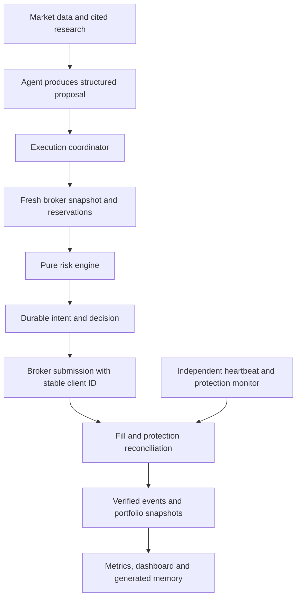

# Project diagnosis — September 17, 2026

**Verdict: a useful paper-trading research project with good foundations, but execution safety and investment edge are both unproven.** Your clarified objective is to learn and prove the system before real money. The next milestone should be a trustworthy experiment: every decision reproducible, every order accounted for, and every reported return traceable to evidence.

Audited checkout: `de48990`. Scope: risk engine, broker scripts, ledger/schema, cloud and local workflows, strategy and operating documentation, test suite/CI, dashboard generation/rendering, and historical memory. Parsed the full EOD and weekly series; examined operational incidents and recent research in detail. This is not a claim to have independently verified every market statement across the approximately 1 MB of memory.

No broker orders, cancellations, emails, production configuration changes, commits, or publication were performed. Production credentials were not inspected. Cloud scheduler settings, actual runtime permissions, current broker positions, and historical fills were not independently accessed. Findings about those environments are explicitly limited to repository evidence.

**What the tests establish**

- Initial suite: **218 passed, 21 skipped**.
- Full suite against a temporary, isolated Postgres 16 database: **239 passed**. The first database attempt was blocked by the filesystem/network sandbox; the authorized rerun passed.
- Dashboard reproducibility check: **passed**.
- Additional offline diagnostic assertions: **7 failed**, representing six distinct gaps because the entry-stop defect has two cases. These assert desired safety behavior; failure reproduces the problem. They sit outside normal test discovery in [probes.py](probes.py).
- Log calculations are reproducible using [metrics.py](metrics.py), with results in [metrics.json](metrics.json).

This is an assessment and recommendation deliverable. Reproduction and measurement are complete; production fixes and their regression verification are future work. The diagnosis skill's repair phases do not apply to an audit-only change.

**What is worth preserving**

The pure `risk_engine` makes deterministic rules inexpensive to test. Decimal handling, explicit violations, separate order/protection payload builders, documented architecture decisions, and the distinction between advice and execution are good choices. The ledger records refusals as well as approvals and has real database tests. Dashboard generation is deterministic and has checks for parsing and benchmark continuity. The September 17 thin cloud prompts address a documented deployment drift problem.

Keep those foundations. A rewrite or distributed microservice architecture would add work without resolving the current failures.

**Priority findings**

| Priority | Finding and evidence | Recommended correction / acceptance test |
|---|---|---|
| P0 | **Order approval is not bound to execution.** `scripts/alpaca.sh:61` trusts `ALPACA_RISK_OK=1`. The offline probe submits an oversized, unprotected payload to a fake transport without any validation. Architecture already acknowledges this under #19/#26. | One execution operation must load fresh state, validate the exact payload, reserve capacity, persist intent, and submit it. An unrelated approval or changed payload must fail. Keep broker credentials outside the research agent's reach if the boundary is intended to resist agent bypass. |
| P0 | **Tightening can lower the actual stop.** `scripts/validate_stop_change.py:126` reconstructs the old stop from today's price instead of the broker's actual stop/high-water mark. With entry 100, historical high 130, current price 120: old 10% stop = 117; new 5% trail starts at 114. The validator approves. | Validate against the actual resting stop. Persist the last accepted floor and confirm broker state after a change. Make this exact counterexample a passing regression test. |
| P0 | **Cancel–replace/close recovery remains prompt-driven.** `routines/midday.md` sequences cancel and order/close, but there is no durable coordinator to resume after process death, delayed cancellation, or a lost response. OTO partial-fill handling alerts/stops rather than completing recovery. | Model intent, cancellation requested/confirmed, partial fills, replacement pending, protected, and incident states in code. Restart after each transition and prove recovery without duplicate orders or unnoticed uncovered shares. |
| P1 | **Transport failure can become success.** `scripts/alpaca.sh:40` suppresses curl's failure when capturing HTTP status; only 4xx/5xx cause failure afterward. Fake curl returning connection error 7 and HTTP `000` produces adapter exit 0. | Preserve transport status and distinguish broker rejection from unknown outcome. After a timeout, reconcile by stable client order ID before retrying. |
| P1 | **Rule 4's stop distance is not enforced.** `risk_engine/engine.py:221` checks existence and minimum distance, but approves both a $1 stop on a $100 entry and a 99% trailing distance. | Encode the documented entry policy: base 10% trail / allowed fixed-stop range, positive valid prices, and unambiguous protection type. Test boundaries and contradictory inputs. |
| P1 | **Paper-only and stocks-only checks are weaker than their names.** The endpoint guard accepts a hostname substring anywhere in a URL and exposes `ALPACA_ALLOW_LIVE`; `_is_paper()` uses the same substring test. The asset check only rejects OCC-shaped symbols: `BTC/USD` passes the engine. | Exact HTTPS hostname/path allowlist; remove the live override from the paper deployment. Validate broker asset class, status, tradability, and allowed instrument universe. Crypto approval here is an engine defect, not proof that the OTO broker request would execute. |
| P1 | **Approved capacity excludes pending commitments.** `PortfolioState` contains filled positions, cash and filled trade count, with no pending-buy reservations or serialization. `--trades-this-week` can override the broker count. | Serialize account mutations; include outstanding orders and committed cash/slots. Keep test overrides inaccessible on the execution path. Two concurrent proposals must not jointly exceed a cap. |
| P1 | **The deployed audit trail is optional and incomplete.** With no `DATABASE_URL`, decisions and responses are not durably ledgered. Cloud prerequisites make the database optional. The live helper supports only submit/stop; routines do not wire the full fill/cancel lifecycle. | Persist every decision and broker lifecycle event to a durable store, with reconciliation. Distinguish reduced-audit paper operation from a verified experiment. Do not reintroduce a missing dependency that blocks protective actions. |
| P1 | **Protection queries cannot certify current protection.** `ledger/store.py:233` checks whether a filled buy ever had a stop response with HTTP <400. It does not establish current status, remaining quantity, cancellation, expiry, or replacement lineage. Routines attach protective sells to separately validated sell IDs, while this query looks on the buy ID. | Link positions/fills to their protective orders. Query current broker coverage, not historical acceptance. Record terminal states and test an accepted-then-canceled stop and separately recorded replacement. |
| P1 | **The dashboard converts dated claims into apparent current facts.** `STATIC_TAIL` substitutes current day/position counts into old claims. Latest data says two fixed stops; RULES says 3/3 trailing. XLI remains OPEN in the curated blotter after its September 14 exit. | Derive protection and open/closed state from structured events. Use verified/unverified/violated with evidence timestamps. Never extend an old audit's coverage by substituting today's day count. |
| P2 | **Runtime identity and deployment health are not recorded.** The routine README documents stale cloud copies until September 17. Code version and strategy version are not pinned in each run; default ledger strategy version is the constant `TRADING-STRATEGY`. | Persist run ID, code commit, prompt hash, strategy hash, model identifier, input timestamps, and completion status. Check thin prompts in the actual scheduler and add missed-run alerts. |

P0 means address before treating the paper system as a proven unattended execution experiment. It does not claim a financial loss has already occurred from each reproduced defect.

The stop example follows Alpaca's documented high-water-mark behavior. Alpaca also documents PATCH updates to the trail parameter of a pending trailing stop; this makes #40 worth revisiting in an isolated paper contract test. It does not prove replacement atomicity or justify inventing unsupported OTO behavior. [Alpaca order documentation](https://docs.alpaca.markets/us/docs/orders-at-alpaca)

**What the recorded performance actually says**

| Measurement | Result | Limitation |
|---|---:|---|
| EOD observations | 97 | Phase counter is 101; observation count is not a complete trading calendar |
| Starting equity, April 27 | $100,000.00 | Markdown baseline |
| Latest equity, September 16 | $102,827.45 | Last committed EOD, not a fresh broker read |
| Change from baseline | **+2.83%** | Assumes no external cash flows |
| Recorded EOD peak, June 2 | $115,135.09 | Sparse/reconstructed portions of history remain |
| Maximum observed EOD drawdown | **−10.69%** | Intraday drawdown may be larger |
| Compounded logged weekly bot returns through September 11 | **+3.99%** | Rounded weekly inputs |
| Compounded chained benchmark over those 20 reviews | **+5.86%** | Eight weeks flagged estimated by the parser |
| Difference across the weekly series | **−1.87 percentage points** | Provisional, not verified investment alpha |

Do not compare September 16's +2.83% with September 11's +5.86% as if their endpoints match. September 11 EOD equity implies +3.93% from inception, while compounded weekly reports imply +3.99%; that smaller mismatch also needs explanation before presenting exact relative performance.

There are **22 differences greater than 0.025 percentage points** between adjacent logged equity changes and reported daily percentages. Some involve missing observations, so they are reconciliation flags, not 22 proven bad daily returns. A concrete adjacent-day inconsistency: June 2 equity $115,135.09 becomes June 3 $114,269.45, a **−0.75%** change, while the log reports **+0.80%**. The dashboard currently trusts the logged daily percentage.

The recovered history and benchmark chaining are useful repairs, but chaining creates internal continuity, not independent market-data verification. Reconcile cash, trades, dividends/corporate actions, and positions from broker exports; keep reconstructed observations explicitly marked. Compute returns from reconciled snapshots and cash flows. Retain the original logs as evidence.

The dashboard's “nothing estimated” text conflicts with the parser's estimated benchmark weeks. Its realized P&L and win count come from a manually curated trade subset, while the prose says recovered winners are available. These measures should be generated from complete executions or labeled incomplete and removed from headline comparisons.

**Architecture and operating flow to aim for**

Use a modular Python application with one credential-owning execution boundary and one durable Postgres store. Research can remain in scheduled agent sessions. Run monitoring independently of whether a research session succeeds.

Recommended module boundaries:

| Module | Owns |
|---|---|
| `research` | Candidate evidence, source timestamps, structured forecasts; no execution credentials |
| `risk_engine` | Pure entry, exit and protection policies |
| `execution` | Validation-to-submission binding, account lock/reservations, idempotency, restart recovery |
| `broker` | Typed transport, exact endpoint verification, timeouts, request IDs and response normalization |
| `ledger` | Durable intents, decisions, fills, order transitions, provenance and cash flows |
| `reconciliation` | Actual quantity/protection matching, stale/missing orders, expiry and incidents |
| `analytics` | Returns, exposure attribution, benchmarks and experiment evaluation |
| `reporting` | Dashboard and concise memory views generated from verified data |

The agent should call operations such as `submit_proposal` and `change_protection`, not assemble shell fragments and decide whether a timed-out POST is safe to repeat. Persist intent before network I/O; after ambiguous outcomes query the broker before retrying. Database idempotency alone does not prevent a duplicated broker order.

Use exchange sessions and broker clock/calendar for scheduling, including holidays and early closes. Add a readiness check for imports, configuration, read-only broker access and storage. Record broker snapshot timestamps and reject stale decision inputs. `read_portfolio()` currently gathers account, positions and orders separately; those reads are not an atomic snapshot.

A protection monitor should compare each held quantity with live protective quantity and status, report price floors and expiries, and alert on uncovered shares or unknown state. Stop presence is not a guaranteed loss cap: stop execution can be worse than the trigger price. [FINRA explanation of stop-order risk](https://www.finra.org/investors/insights/stop-orders-factors-consider-during-volatile-markets)

**How to improve the trading experiment**

Your present record does not establish a repeatable profitable edge. It combines discretionary stock selection, sector ETFs, changing deployment rules, reconstructed fills, and changing operational behavior. Separate the question “does the machinery work?” from “does this decision policy add value?” and measure both.

1. **Freeze an experiment specification.** Define start/end dates, allowed universe, benchmark, risk budget, transaction assumptions and rules for missing data. The challenge window is still a placeholder. Version any strategy change; weekly reviews should propose changes for a new experiment rather than silently change the one being evaluated.
2. **Run comparable shadow baselines.** Measure the agent against a passive broad-market portfolio, an exposure-matched broad-market/cash portfolio, and one simple deterministic sector-momentum policy. Use identical dates, execution assumptions and dividend treatment. The full-market baseline measures opportunity cost; the exposure-matched baseline helps distinguish cash allocation from selection.
3. **Measure value after costs.** Track slippage assumptions, spreads, fees, research/model charges and infrastructure. For illustration, $100/month of fixed operating expense is a 1.2% annual hurdle on $100,000 and 12% on $10,000, before trading costs. Actual spend is not recorded here, so this is not an estimate of your bill.
4. **Make entries falsifiable.** Record the predicted event, expected direction, horizon, target, invalidation condition and probability before entry. Evaluate calibration and realized outcomes later. “Bear case refuted” is too binary and can reward persuasive text; require the strongest contrary evidence and conditions under which it wins.
5. **Replace narrative momentum with a specified candidate rule.** Define return lookbacks, volatility/liquidity filters and selection timing. Let the agent assess documented catalysts on the resulting shortlist. Test whether it adds value compared with that shortlist alone.
6. **Test deployment and sizing rather than assume them.** A 75–85% mandate may reduce cash drag in rising markets, but it is not evidence that the forced next purchase has positive expectancy. Compare the current mandate with a predefined alternative in shadow portfolios. A 20% position with a 10% stop exposes roughly 2% of equity to its planned stop distance before gaps/slippage; four correlated positions can accumulate substantial joint risk. Evaluate portfolio risk and overlap, not only ticker count.
7. **Separate position management from trade frequency.** The three-new-trades rule needs a definition for adds, partial fills and canceled buys. Protective actions should have their own policy. The −7% manual exit at midday is a scheduled observation rule, not a continuous −7% loss guarantee.
8. **Use prospective evaluation.** An old-news backtest involving a modern model can leak future knowledge. Prefer timestamped forward paper decisions; if backtesting, restrict available evidence and label remaining model-knowledge leakage. Keep a held-out evaluation period and do not select a winner from a handful of favorable trades.

Alpaca states that paper simulation omits dividends, regulatory fees, latency slippage, market impact and some other real-execution effects. Therefore, raw paper equity is not automatically a total-return series. Build an explicit dividend/cost-adjusted research series alongside raw paper equity and apply the same accounting to baselines. [Alpaca paper-trading limitations](https://docs.alpaca.markets/us/docs/paper-trading)

**Dashboard, memory and developer workflow**

- Make the dashboard lead with verified-as-of time, protection coverage, unresolved incidents, latest completed routine and reconciliation status. Put return, drawdown and benchmark comparisons next, using aligned periods. Keep commentary visually separate from measurements.
- Calculate source staleness against the current time/session, not only the difference between log date and editorial date. Display incomplete periods and reconstructed points distinctly.
- Generate a compact current-state document from structured events. Keep historical research as an archive and retrieve relevant dated entries; avoid making a 603 KB research log the agent's operational memory.
- Move shared orchestration out of duplicated `routines/` and `.claude/commands/` prose. The thin cloud prompt is progress; local and cloud entry points should call the same tested operations.
- Add meaningful scenario tests: restart after accepted order with lost response, partial fill, stop rejected, delayed cancel, expiry, stale quote, two concurrent buys, database outage, early close and corporate action. Existing tests that look for wording in prompts cannot prove a running agent executes that wording.
- Pin the tested dependency environment in CI; exercise both supported Python compatibility and the production runtime. CI's ledger anti-skip step checks collection output, not actual executed/skipped counts; assert actual integration test outcomes.
- Make migrations version-aware. `ledger.store.migrate()` currently reruns every SQL file at each ledger open. Use a migration role separately from the restricted runtime writer. Only `audit_events` has explicit update/delete protection; “immutable ledger” is broader than the current guarantee.
- Fix structured financial error handling: adapter failures use `sys.exit(message)` (exit 1) despite documented exit 4, and malformed numeric/broker fields can raise uncaught exceptions. Test stable error categories and human-readable diagnostics.
- Replace the dashboard parser's hardcoded year with explicit dates in structured snapshots. Isolate operational deployment counting from presentation parsing; `deployment_status.py` currently imports the dashboard builder to interpret memory.
- Resolve the disclosure policy conflict: `PROJECT-CONTEXT.md` prohibits external positions/P&L disclosure, while the repository advertises a public dashboard. Do not automatically publish additional audit/account data until the intended visibility is explicit. This report stays local.

**A practical sequence and proof gates**

| Stage | Work | Evidence required to finish |
|---|---|---|
| 1 — Repair known correctness gaps | HWM-aware stop validation, entry-distance/asset checks, exact endpoint guard, transport errors, truthful dashboard | Diagnostic assertions turn green through intended behavior; normal suite remains green |
| 2 — Make execution recoverable | One submission boundary, stable client IDs, reservations, lifecycle persistence, reconciliation, independent alerting | Restart at each order transition; zero duplicate economic orders; every uncovered state detected and handled |
| 3 — Establish reliable accounting | Reconcile historical broker exports, record dividends/cash flows/costs, aligned baselines, strategy/run provenance | Every reported number traceable to source data; unresolved differences labeled rather than explained away |
| 4 — Run a frozen paper experiment | Agent policy and simple baselines, prospective forecasts, cost accounting, periodic review without rule drift | Sufficient independent decisions for uncertainty estimates; results survive cost assumptions and comparison with baselines |

As an operational target, require **30 consecutive trading sessions** with complete run records, no unexplained reconciliation differences and successful recovery drills. That is a proposed reliability gate, not statistical proof of profitability. Financial evidence needs its own sample-size and uncertainty analysis; a calendar streak or profitable month does not supply it.

Do not make “more trades,” “more agents,” or “a more confident research prompt” the next milestone. The highest-value next deliverable is a deterministic, auditable paper execution path. Once that works, the project can teach you whether its investment decisions are worth paying for.
